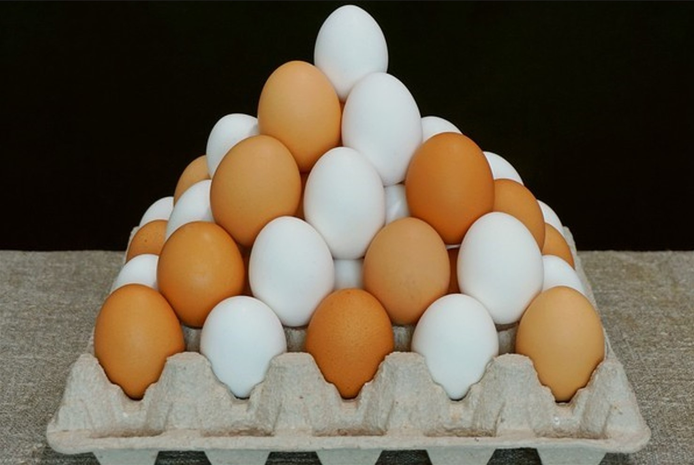
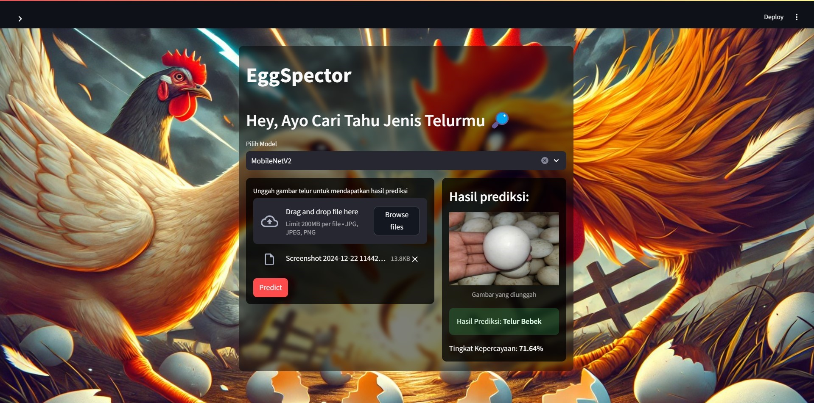

# Submission UAP ML VIIB
## 🦖 EggSpector: Klasifikasi Citra Jenis Telur Ayam & Bebek Dengan Mengimplementasikan VGG-16 & MobileNetV2





## Deskripsi Project

Proyek ini bertujuan untuk mengembangkan sistem klasifikasi gambar yang dapat mengenali dan membedakan jenis telur unggas, yaitu telur ayam dan bebek, menggunakan arsitektur deep learning **VGG-16** dan **MobileNetV2**. Dengan memanfaatkan dataset gambar telur, sistem ini dirancang untuk membantu peternak dan pelaku agribisnis dalam mengidentifikasi jenis telur secara otomatis, sehingga meningkatkan efisiensi proses sortir, pengelolaan hasil ternak, dan pengambilan keputusan yang lebih cepat serta akurat.

Dataset yang digunakan dapat anda akses pada link : [Egg Classification](https://www.kaggle.com/datasets/gauravduttakiit/automated-egg-classification).

Arsitektur yang digunakan adalah model pre-trained yaitu VGG-16 dan MobileNetV2 dengan model arsitektur seperti gambar dibawah ini.

#### VGG-16


#### MobileNetV2


## Overview Dataset

Dataset  klasifikasi jenis telur yang digunakan bersumber dari platform Kaggle dengan total 2 class yang total datanya berjumlah 14.7k file. Pembagian data split dengan rasio 80:10:10 tvt, pada dataset ini terdapat 2 Label Class, yaitu : 🐔 chicken & 🦆 duck.


## Langkah Instalasi

Clone the project
```bash
  git clone https://github.com/ilhamnn/UAP-ML-7B
```

Go to the project directory

```bash
  cd project folder
```

Start the server
```bash
  streamlit run ./view/src/lut.py
```


## Deskripsi Model

#### Cleaning

Beberapa gambar yang tidak sesuai akan dihapus untuk meningkatkan kualitas data yang digunakan dalam pelatihan.

#### Pre-processing

Pengaturan untuk Training dengan ImageDataGenerator

Menggunakan ImageDataGenerator untuk memuat dan memproses gambar dari direktori yang ditentukan. Gambar akan diubah ukurannya menjadi 224x224 piksel dengan ukuran batch 8.

- Melakukan rescaling untuk menormalkan nilai piksel ke rentang [0, 1].

- Kualitas gambar juga dikurangi dengan menurunkan resolusi untuk mempercepat proses pelatihan dan mengurangi waktu komputasi.

- Untuk data validasi dan pengujian, hanya dilakukan rescaling tanpa augmentasi agar data tetap konsisten dan menjaga integritasnya selama evaluasi model.

Dengan konfigurasi ini, model dapat belajar dari variasi gambar yang ada selama pelatihan, sementara preprocessing untuk evaluasi tetap sesuai dan konsisten.

### **VGG-16**


Model ini menggunakan VGG-16 dengan bobot pra-latih dari ImageNet sebagai extractor fitur. Layer tambahan terdiri dari Global Average Pooling, dense 256 unit (ReLU), Dropout 0.3, dan output 2 unit (Softmax).
Dari total 14,846,530 parameter, 131,842 dapat dilatih, 
konfigurasi ini memanfaatkan VGG-16 untuk ekstraksi fitur dan melatih layer tambahan untuk klasifikasi jenis telur.


Hasil dari model :


### Analisis Hasil Evaluasi Model

**Performa**:

Model VGG menghasilkan metrik sempurna pada data uji dengan precision, recall, dan F1-score sebesar 1.00 untuk kedua kelas (Ayam dan Bebek). Hal ini menunjukkan bahwa VGG mampu mengklasifikasikan semua sampel secara akurat tanpa kesalahan.

**Training**:

Grafik menunjukkan konvergensi bertahap, dengan penurunan loss yang stabil pada training dan validation. Akurasi mencapai 1.00 pada validation setelah beberapa epoch, mencerminkan proses pembelajaran yang konsisten.
Meski performanya baik, pola grafik mengindikasikan kemungkinan model overfitting terhadap data training karena loss sangat rendah tanpa perbedaan signifikan dengan validation loss.


### **MobileNetV2**


Model ini menggunakan MobileNetV2 dengan bobot pra-latih dari ImageNet sebagai extractor fitur. Layer tambahan terdiri dari Global Average Pooling, dense 256 unit (ReLU), Dropout 0.3, dan output 4 unit (Softmax).
Dari total 2,586,434 parameter, 1,214,530 dapat dilatih.


Hasil dari model :


### Analisis Hasil Evaluasi Model
**Performa**:

MobileNetV2 menghasilkan metrik sempurna pada data uji dengan precision, recall, dan F1-score sebesar 1.00 untuk kedua kelas. Hal ini menunjukkan kemampuan klasifikasi yang setara dengan VGG dalam hal akurasi.

**Training**:

Grafik menunjukkan konvergensi yang sangat cepat, di mana training dan validation loss mendekati nol dalam beberapa epoch awal. Akurasi juga langsung mencapai 1.00 tanpa fluktuasi berarti.
Hal ini mencerminkan efisiensi MobileNetV2 yang dirancang untuk kinerja optimal dengan arsitektur yang ringan.

## Live Demo 

[Link Streamlit](https://uap-ml-7b.streamlit.app/).

## Tampilan

### Homepage


### Prediction Result



